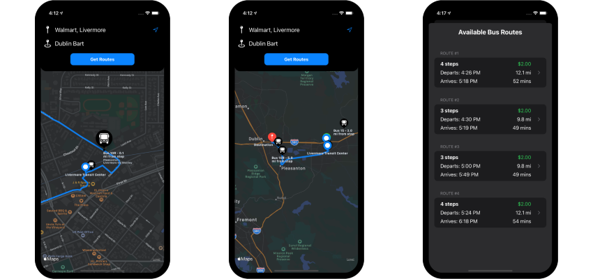

# Bus Buddy

## About the app

### Bus Buddy

Bus Buddy allows users to find bus routes to their destinations all across the Livermore-Amador Valley. Simply enter a destination and choose a route to see where you need to go and where your bus is.

### How it works

The app uses the Google Directions API to find possible routes between the origin and destination addresses. From there is uses the 511.org Open Transit Data to find the locations of the required buses.

 

## Concepts used

* MVC Architecture
* Storyboard and AutoLayour
* Working with networking and JSON data
* CoreLocation and MapKit

### Features:

- [x] Route Selection
- [x] Polyline and Annotations
- [x] Live Bus Location and Distance

 
 
